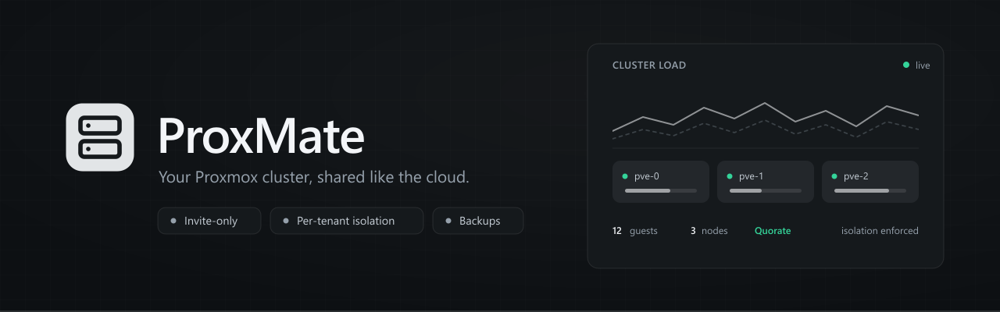
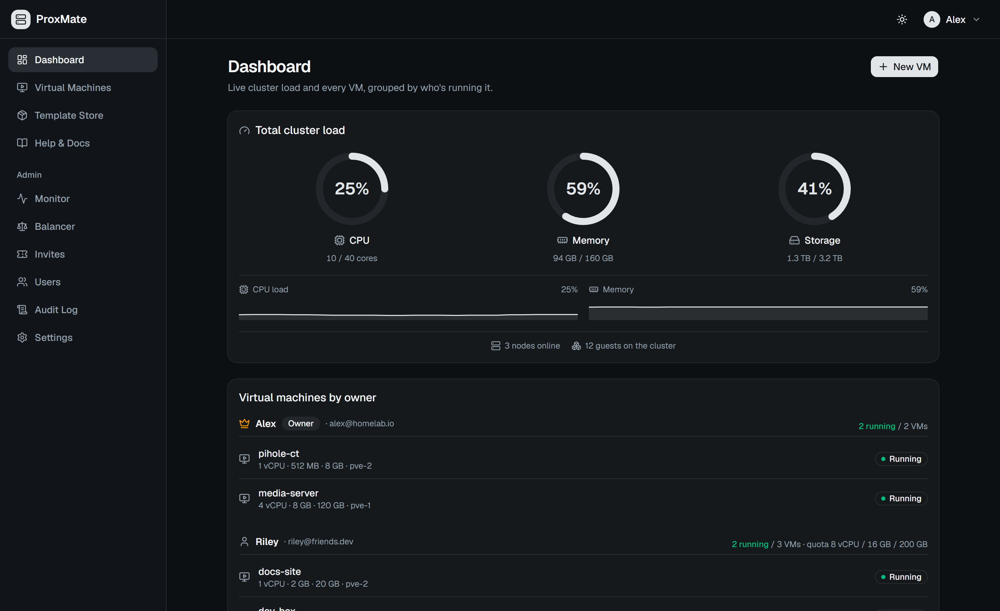
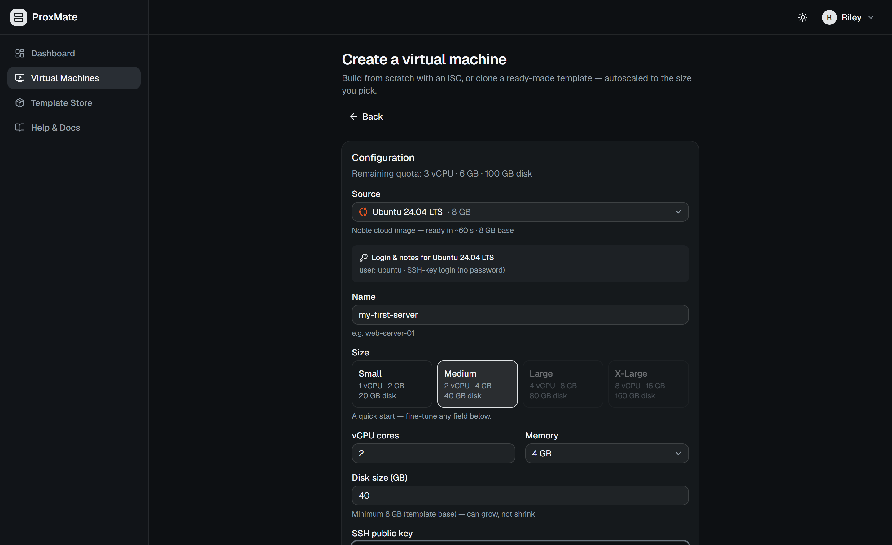
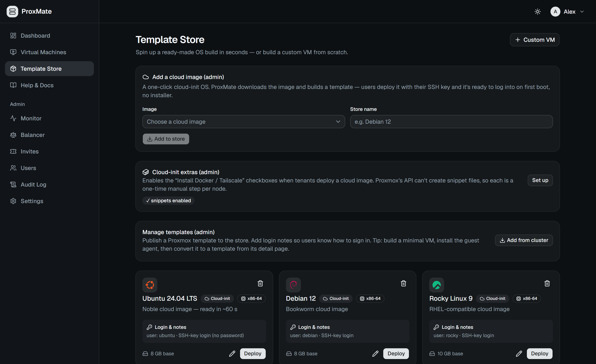
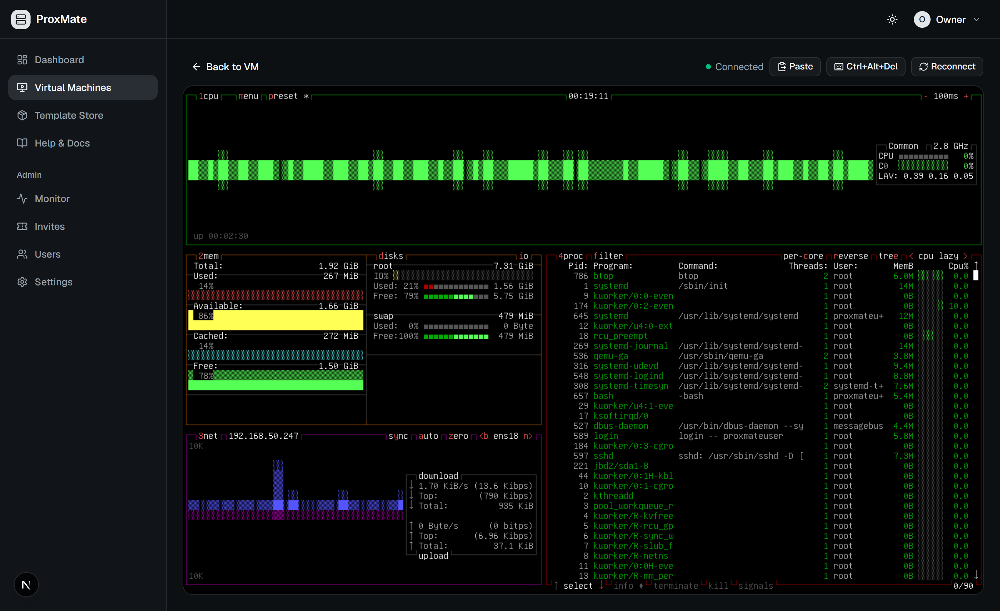
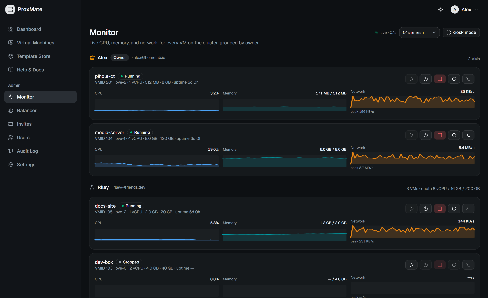
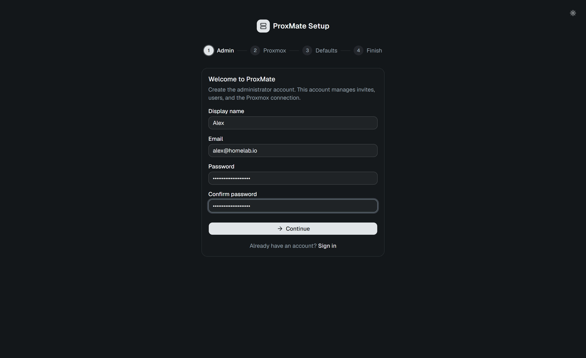

<div align="center">



<br/>

<p>
  <a href="https://github.com/conzex/proxima/blob/main/LICENSE"></a>
  
  
  
  
  <a href="https://github.com/conzex/proxima/actions/workflows/ci.yml"></a>
</p>

**A lightweight, invite-only cloud dashboard built on Proxmox VE.**

Proxima gives you a DigitalOcean-style WebUI on top of your existing Proxmox cluster.
Hand out invite links with resource quotas, let users spin up VMs and LXC containers —
from an ISO, a template, or a one-click cloud image (paste an SSH key → a ready-to-SSH
box in ~60 s) — and access them via an in-browser console, all without exposing your
Proxmox admin panel.

[Quick start](#quick-start) · [Features](#features) · [Screenshots](#screenshots) · [Production](#production-deployment) · [Docs](#documentation)

</div>

---

## Features

- **Invite-only multi-tenancy** — invite links carry CPU/RAM/disk quotas; a per-VM firewall keeps tenants off your LAN, your other guests, and the host **once the Proxmox cluster firewall is enabled** (Proxima walks you through that in-app)
- **VMs & LXC containers** — create from an ISO, the Template Store, or 20 curated cloud images (16 x86-64 + 4 ARM64); resize, rebuild, rename, snapshots, power schedules, tags & bulk actions
- **Share a VM** — hand another tenant access at one of three preset levels (Viewer / Operator / Manager); no share level can delete, rebuild, migrate, or re-share
- **In-browser consoles** — graphical (noVNC) *and* a text console with clickable links, real copy/paste, and scrollback — no SSH, no open ports
- **Proxima IDE (beta)** — a per-VM **browser IDE** (VS Code / code-server) opened inside the tenant's own VM, with an **in-guest AI coding agent** (OpenCode) wired to admin-controlled models; reuses your tenant-isolation firewall — [docs](docs/proxima-ide.md)
- **Serious auth** — TOTP 2FA, passkeys (WebAuthn), bring-your-own OIDC SSO, SMTP password resets, optional invite-enforced 2FA
- **Time-boxed access** — invites can grant a fixed term (or never expire); when a window closes Proxima **suspends, never deletes** — VMs stop, sign-in is refused, nothing is destroyed
- **MateStates backups** — scheduled backups with rolling retention, one-click in-place restore, per-VM policies, quick snapshots — plus nightly backups of **Proxima's own database** to a host directory
- **Cluster operations** — automatic VM placement, live migration, DRS-style memory balancer, maintenance node-drain, GPU/PCI passthrough requests
- **Operator visibility** — live admin monitor (1 Hz sparklines), monitoring-only rack-panel kiosk, audit log, Prometheus `/metrics`
- **In-app updates** — check the latest GitHub release and one-click rebuild onto it

<details>
<summary><b>Full feature matrix</b> — the feature set, one table</summary>
<br/>

| Feature | Description |
|---|---|
| **Invite-Only Registration** | Admin-generated invite links with CPU/RAM/Storage quotas, with optional **enforced 2FA** on registration |
| **Multi-Factor Auth (MFA/2FA)** | Secure accounts via TOTP (authenticator apps) with recovery codes, or passwordless **Passkeys (WebAuthn)** using biometric keys |
| **Single Sign-On (OIDC SSO)** | Bring-your-own SSO (Keycloak, Authentik, etc.) with custom group-to-admin mapping and optional JIT user provisioning |
| **SMTP & Password Recovery** | Email-based secure password resets, with a database-backed "contact admin" request queue if SMTP is disabled |
| **VM Lifecycle Management** | Create, start, stop, restart, **rename**, and delete VMs — each VM page has editable **notes**, an **activity timeline**, and **CPU/memory history charts**. The create wizard offers one-click **size presets** (Small → X-Large) |
| **LXC Containers** | Spin up lightweight **LXC containers** alongside full VMs — create from an OS template, start/stop/restart, in-browser console, tenant isolation, quotas, cpu/RAM/rootfs resize, and MateStates backups. Shares the host kernel, boots in seconds |
| **Cloud-Init Deploys** | One-click cloud images (20 curated distros — 16 x86-64 and 4 ARM64 — plus custom URLs), imported entirely through the Proxmox API — paste an SSH key for a ready-to-SSH box in ~60s. Admin-curated first-boot **extras** (Docker, Tailscale, Superfile, Cockpit, Netdata, Caddy, code-server, …) plus an **always-on base** (fail2ban / unattended-upgrades / btop) installed on every VM. Proxima can **write the cloud-init snippet on demand** to a shared storage at deploy time (no per-node file placement). **Save SSH keys** to your profile and pick them on deploy |
| **Add an SSH key to a running VM** | Drop one of your saved (or pasted) public keys onto an existing VM's user — appended to `authorized_keys` **via the QEMU guest agent**, no rebuild or reboot. Idempotent, permission-safe, and validated (no shell-injection surface) |
| **Template Store** | Publish Proxmox templates as one-click OS builds — cloned and autoscaled on deploy, with OS-matched (or custom-uploaded) icons and admin-authored login notes |
| **Automatic VM Placement** | Tenants never pick a node — the scheduler auto-places each VM on a node that has the chosen image, with the most free capacity |
| **Live VM Migration** | Admins move a VM to another cluster node with **no downtime** — live for running guests (incl. those on node-local storage), offline for stopped ones — and the VM's owner gets an emailed heads-up. Architecture-guardrailed (never x86↔ARM), and the picker only offers nodes the guest can actually reach (storage-aware) |
| **Cluster Balancer & Maintenance** | DRS-style **memory-load balancing** (recommend-only or auto) that live-migrates guests off the busiest node, plus one-click **maintenance node-drain** to evacuate a host before downtime — with anti-affinity (`aa:` tags), pinning, and **storage-migratability** guardrails (it never proposes a move a guest can't make) |
| **GPU / PCI Passthrough** | Tenants request a GPU or other PCI device; admins review and attach an available device — with a **pre-flight host-readiness check** (device present, IOMMU on, boot mode) that refuses to attach/boot on an unprepared host, plus balancer/migration guardrails once attached |
| **In-Browser Console** | A **graphical (noVNC)** console *and* an **xterm.js text console** with **Ctrl/Cmd-clickable links**, real copy/paste, and scrollback — both proxied securely through the backend, no SSH or open ports |
| **MateStates Backups** | Scheduled weekly backups + one-click in-place restore, with rolling retention |
| **Quick Snapshots** | Instant Proxmox snapshots — take / roll back / delete, with optional RAM-state capture — for "before I change something" restore points (distinct from durable MateStates backups) |
| **Power Schedule** | Auto start/stop any VM on a weekly schedule — handy for dev boxes that don't need to run overnight |
| **In-App Updates** | Admins check the latest GitHub release, see what's new, and (opt-in) one-click rebuild + restart onto the new version |
| **Live Admin Monitor** | Per-VM CPU / memory / network sparklines at 1 Hz, with power controls, grouped by owner |
| **Kiosk Mode** | A full-screen, touch-friendly wall panel for a rack-mounted display — cluster gauges, quorum tile, per-node strip, activity feed. **Monitoring only**: no VM power controls and no links off the panel, so an unattended screen can't be used to act on a tenant's VM or slip past the passkey/PIN exit gate |
| **Compute Access Windows** | Time-box a tenant's access — invites can grant a fixed term (or never expire), with an admin per-user override. Expiry **suspends, never deletes**: VMs stop and sign-in is refused across every auth path, but nothing is destroyed. 7-day and 1-day warning emails, plus an admin notification when a window closes |
| **App-Database Backups** | Proxima backs up **itself** on a nightly schedule (`VACUUM INTO`, consistent on a live DB) with rolling retention, written to a host directory you choose via `PROXIMA_BACKUP_DIR`. Pair it with an off-host copy of `ENCRYPTION_KEY` — a snapshot without the key restores nothing |
| **Tenant Network Isolation** | Per-VM Proxmox firewall — MAC filtering, RFC1918 drop rules, and a configurable DNS allow-list — keeps guests off your LAN, your other VMs, and the host. **Requires the Proxmox cluster firewall to be enabled**; Proxima turns it on for you from the admin UI, adding management allow-rules first so you can't lock yourself out |
| **Share a VM** | Grant another tenant access to a guest at one of three preset levels — **Viewer** (see the VM and its status), **Operator** (+ power actions and console), **Manager** (+ config, resize, backups, IDE). No share level can delete, rebuild, migrate, re-share, or touch passthrough — those stay owner/admin only |
| **Admin Deploy-for-Tenant** | Admins create a VM directly inside a chosen tenant's account, optionally pinning the node and optionally as a **quota-exempt** grant. Admin-provisioned VMs are resize- and rebuild-locked to admins, and a Manager-share resize bills the VM **owner's** quota, not the caller's |
| **Personal API Tokens & REST API** | Per-user `pm_…` Bearer tokens for the public REST API (OpenAPI spec included) — only the token hash is stored, and public token lookups are separately throttled |
| **Audit Log** | Who created / deleted / restored / started which VM, plus sign-ins — an admin-viewable activity trail |
| **Rate Limiting** | Built-in brute-force protection on the login / register / invite endpoints, plus per-account lockout with admin alerts and dedicated throttling on public token lookups |
| **Outbound & Secret Hardening** | Admin-configured webhooks and cloud-image URLs are **SSRF-guarded** (private/loopback/metadata blocked; opt-in for LAN targets); secrets are AES-256-GCM at rest with a **fail-closed** key requirement; `/metrics` is token-gated in production |
| **Resource Quotas** | Users can only provision resources within their assigned limits — with a built-in quota-increase request workflow |
| **First-Time Setup Wizard** | Guided OOBE to configure admin credentials and the Proxmox connection |
| **Docker + CI** | Multi-stage production images, plus GitHub Actions CI (typecheck, tests, image builds) and an automated test suite |

</details>

<details>
<summary><b>Tech stack</b></summary>
<br/>

| Layer | Technology |
|---|---|
| **Frontend** | Next.js 16 (App Router), TailwindCSS v4, Shadcn/UI (Base UI), react-icons |
| **Backend** | Node.js, Express 5, `ws` (WebSocket relay), `express-rate-limit`, `node-cron`, `nodemailer` |
| **Database** | SQLite via Prisma ORM (migrations); PostgreSQL supported for scale-out |
| **Auth** | JWT + bcrypt, OIDC SSO (`openid-client`), Passkeys (`@simplewebauthn/server`), TOTP 2FA (`otplib`), SMTP |
| **Proxmox** | REST API with API Token authentication |
| **Console** | noVNC (graphical) + xterm.js (text) over a WebSocket proxy |
| **Testing / CI** | Vitest, Playwright, GitHub Actions (CodeQL, Trivy, SBOM) |

</details>

---

## Screenshots

<div align="center">


*Live cluster capacity and every virtual machine at a glance*

</div>

<details>
<summary><b>More screenshots</b> — create wizard, Template Store, console, live monitor, setup (5)</summary>
<br/>
<div align="center">

### Create a VM

*One wizard for custom (ISO), template, and cloud-init deploys — paste an SSH key and tenants are auto-placed on the best node*

### Template Store

*Add cloud images in one click and publish ready-made OS builds — OS-matched icons, login notes, deploy in seconds*

### In-Browser Console

*A live, interactive noVNC session on your VM — copy/paste and Ctrl+Alt+Del, no SSH or open ports needed*

### Live Monitor

*Per-VM CPU / memory / network sparklines at 1 Hz, with power controls*

### First-Time Setup

*Guided wizard to create the admin account and connect your Proxmox cluster*

</div>
</details>

---

## Install

One command, from a clean Linux machine to the setup wizard in about six minutes:

```bash
curl -fsSLO https://raw.githubusercontent.com/conzex/proxima/main/install.sh
less install.sh
bash install.sh
```

That middle line is not decoration. This is deliberately **not** a `curl | sudo bash`
one-liner: Proxima ends up holding a Proxmox API token that is effectively root on
your cluster, so read the script before you run it.

The installer checks what your machine is missing — Docker, Compose v2, git, curl,
openssl — and offers to install it. It generates your `ENCRYPTION_KEY`, writes a
correct `.env` for either an HTTP trial or an HTTPS domain, builds the stack, and
stops at the browser wizard, because that is where the Proxmox token is entered
rather than on a command line where it would land in your shell history.

| | |
|---|---|
| **Needs** | A Linux host and **sudo rights** — installing Docker and packages requires them, so you will be asked for your password. |
| **Docker** | Not required up front. If it is missing you are asked before anything is installed, and declining changes nothing on the machine. |
| **Resources** | Roughly 4 GB RAM and 5 GB disk for the build; less is warned about rather than discovered halfway through. |
| **Distributions** | Debian, Ubuntu, Fedora, RHEL, CentOS, Rocky, openSUSE and Alpine. On Arch it prints the two commands to run rather than upgrading your system unasked. |

Common flags: `--local` for an HTTP trial on your LAN address, `--domain <host>` for a
single HTTPS origin behind your own reverse proxy, `--dir` to install elsewhere,
`--ref` to pin a version, `--no-start` to write the configuration without building.
Run `bash install.sh --help` for the rest.

**Prefer an agent to walk it with you?** [`DEPLOY_WITH_CLAUDE.md`](./DEPLOY_WITH_CLAUDE.md)
is a runbook written as executable instructions for a coding agent. It is a supported
alternative, not a legacy path — point your agent at it and it handles the same deploy
conversationally.

---

## Quick start (development)

For working on Proxima itself rather than running it.

**Prerequisites:** Node.js 20+, a Proxmox VE cluster (tested on PVE 9.2), and a
[Proxmox API token](https://pve.proxmox.com/wiki/User_Management#pveum_tokens).

> **The #1 setup pitfall:** Proxmox creates API tokens with *Privilege Separation*
> enabled, which leaves the token with an **empty permission set** (even for `root`) —
> the connection test passes but storage lists come back empty and VM creation 403s.
> Uncheck it, or grant the token a role — see the
> [admin guide §1.1](./docs/admin-guide.md#11-create-the-api-token).

```bash
git clone https://github.com/conzex/proxima.git
cd Proxima

# Backend (Express API on :4000)
cd backend
npm install
cp ../.env.example .env        # edit if needed
npx prisma migrate deploy
npm run dev

# Frontend (Next.js on :3000) — second terminal
cd frontend
npm install
npm run dev
```

Open `http://localhost:3000` — the **setup wizard** walks you through creating the
admin account, connecting Proxmox, and picking storage/network defaults. Then generate
invite links for your users from **Admin → Invites**.

---

## Production deployment (Native Node.js & PM2)

```bash
# Install & build backend and frontend
cd backend && npm install && npx prisma generate && cd ..
cd frontend && npm install && cd ..
npm run build

# Start natively with PM2
npx pm2 start deploy/pm2.config.js
```

> **Editing `.env` is not optional.** The file ships with its **PRODUCTION** block
> active and pointing at `proxima.example.com`, bound to `127.0.0.1`. Either replace
> that domain throughout, or comment the PRODUCTION block out and uncomment the LOCAL
> one. Skipping this gets you a frontend bundle that calls a domain you don't own, on
> ports only reachable from the machine itself — `NEXT_PUBLIC_API_URL` is baked in at
> **build time**, so fixing it later means rebuilding the frontend image.

> **`ENCRYPTION_KEY` must stay constant** across restarts — it decrypts your stored
> Proxmox token, JWT secret, SMTP password, and TOTP secrets. **Keep one copy off the
> host** (a password manager is enough — it never changes): every database backup is
> encrypted under this key, so a snapshot without it restores nothing useful. Losing
> the machine and the key together loses the secrets even if the backups survived.
> `NEXT_PUBLIC_API_URL` is baked into the frontend at **build time**, so rebuild the
> frontend image if it changes.

Upgrades run from a **release tag**, not `main`, and database migrations apply
automatically when the backend container starts — never run them by hand:

```bash
./deploy/update.sh             # newest vX.Y.Z tag, rebuild + restart
./deploy/update.sh v0.8.6      # or pin a specific tag
```

For a real public deployment, serve Proxima from a **single HTTPS origin** (passkeys,
`Secure` cookies, and OIDC SSO require it) behind Caddy / nginx / Traefik or a
Cloudflare Tunnel. The complete runbook — reverse-proxy topology, env reference,
tenant isolation, Keycloak SSO, SMTP, and the 2FA test matrix — is in
**[DEPLOYMENT.md](./DEPLOYMENT.md)**; the hardening guide is
**[SECURITY.md](./SECURITY.md)**.

---

## Testing & CI

The backend ships a Vitest suite (718 tests) covering the security-critical logic —
quotas, the per-VM firewall builder, placement, retention, ownership and share
permissions, compute access windows, balancer/drain planning, cloud-init snippet
generation, guest-agent SSH-key injection, migration migratability, and the
outbound-URL/SSRF guard — against a mocked Proxmox API (no live cluster needed):

```bash
cd backend && npm test
```

Every push and PR runs [GitHub Actions](.github/workflows/ci.yml): backend typecheck +
tests, frontend lint + build, Playwright, and Docker builds of both images, plus a
separate [security workflow](.github/workflows/security.yml) (CodeQL, Trivy, SBOM).

---

## Documentation

The three tenant guides are surfaced in-app under **Help & Docs**, along with the admin
and security guides for admins.

| Guide | Audience | What's inside |
|---|---|---|
| [Production runbook](./DEPLOYMENT.md) | Owners | HTTPS origin, Caddy/Cloudflare Tunnel, Keycloak SSO, SMTP, 2FA matrix, kiosk autostart |
| [Security guide](./SECURITY.md) | Owners | Tenant isolation model, cluster firewall step, least-privilege tokens, hardening checklist |
| [Admin guide](./docs/admin-guide.md) | Owners | Cluster prep, API tokens, isolation enforcement, cloud images, auth settings, troubleshooting |
| [External access overview](./docs/external-access.md) | Tenants | The "no port forwarding" rule and which tool fits each use case |
| [Tailscale for SSH](./docs/tailscale-ssh.md) | Tenants | SSH into your VM from anywhere, no public IP |
| [Cloudflare Tunnels](./docs/cloudflare-tunnels.md) | Tenants | Publish a public website from your VM without opening ports |
| [REST API & scaling](./docs/api.md) | Developers | Personal `pm_…` tokens, OpenAPI spec, `/metrics`, PostgreSQL |
| [Roadmap](./ROADMAP.md) | Everyone | Shipped, planned, and proposed features |
| [Architecture spec](./project-architecture.md) | Contributors | Full system design — request flows, schema, security model |

---

## Community

Questions, ideas, or a homelab to show off? Join the
[Discussions](https://github.com/conzex/proxima/discussions):
[Q&A](https://github.com/conzex/proxima/discussions/categories/q-a) ·
[Ideas](https://github.com/conzex/proxima/discussions/categories/ideas) ·
[Show & Tell](https://github.com/conzex/proxima/discussions/categories/show-and-tell) ·
[General](https://github.com/conzex/proxima/discussions/categories/general)
— and see the [Contributing Guide](CONTRIBUTING.md) for how to get involved.

---

## License & Attribution

Proxima is a proprietary product of **CONZEX GLOBAL PRIVATE LIMITED**.  
Website: [https://www.conzex.com](https://www.conzex.com)

---

<div align="center">
  <sub>© CONZEX GLOBAL PRIVATE LIMITED — Proprietary Product.</sub>
</div>
</div>
